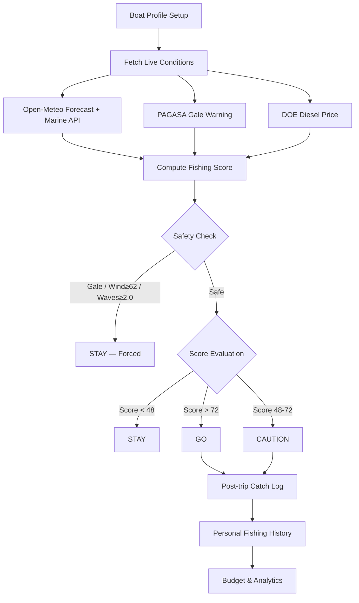

# TripWise

**Fishermen Safety + Economic Decision Support for Philippine Municipal Fishers**

TripWise is an offline-first web application that helps small-scale fishers in Navotas and Manila Bay make a pre-trip **GO / CAUTION / STAY** decision by combining real-time economic viability analysis with live safety conditions.

---

## Overview

Filipino municipal fishers face a daily gamble: burn ₱500–₱1,200 in diesel with no guarantee of catching enough to break even, while also risking dangerous seas that could cost them days of income — or worse.

TripWise gives them a single, honest answer before they leave the shore: **Is this trip worth the diesel and safe enough to come home?**

The app pulls live weather, wave, tide, and gale data; combines it with DOE fuel prices and the fisher's own boat profile; and produces a transparent fishing score (0–100) mapped to a clear verdict:

- **GO** — Conditions are favorable, trip should be profitable
- **CAUTION** — Proceed with care, monitor conditions
- **STAY** — Too dangerous or economically unviable. Do not leave.

Every number is checkable. Every calculation is shown. No black box.

---

## Problem

Philippine municipal fishers — approximately 1.2 million operators of small motorized bangkas — face compounding challenges:

- **High fuel costs** — Diesel at ₱65–₱80/L makes every trip a significant cash outlay
- **Uncertain catch** — Revenue depends on conditions, season, and luck
- **Safety risks** — Sudden weather changes, gale-force winds, and high waves can be lethal
- **Fragmented information** — Weather, fuel prices, tide tables, and market prices are scattered across different sources, often unavailable offline
- **Decision by intuition** — Most fishers rely on experience and word-of-mouth rather than integrated data
- **Income volatility** — One bad trip can wipe out multiple days of earnings

There is no existing tool that combines economic break-even analysis with safety assessment in a single, mobile-first interface that works with weak or no signal.

---

## Solution

TripWise implements a transparent decision loop:

```
Boat Profile → Live Conditions → Trip Cost → Break-even Catch →
Expected Revenue → Safety Check → GO / CAUTION / STAY → Post-trip Catch Log
```

| Step | Purpose |
|------|---------|
| **Boat Profile** | Motor class, trip duration, fishing ground, gear — determines fuel consumption |
| **Live Conditions** | Real-time wind, waves, rain, tide, gale warnings from Open-Meteo + PAGASA |
| **Trip Cost** | Fuel liters × diesel price (live DOE data) |
| **Break-even Catch** | Minimum kilograms needed at local market prices to cover fuel |
| **Expected Revenue** | Based on typical catch for conditions and ground |
| **Safety Check** | Hard override — dangerous conditions force STAY regardless of economics |
| **Verdict** | GO / CAUTION / STAY with a 0–100 fishing score |
| **Show the Math** | Full transparency — every input and calculation is visible |
| **What-If** | Interactive sliders to explore different scenarios |
| **Catch Log** | Post-trip recording builds personal fishing history |

---

## Safety-First Design

Safety always overrides economics. The decision engine enforces hard safety thresholds:

```
Economic Analysis
       ↓
   Safety Check
       ↓
   Unsafe? ── YES ──→ STAY (forced)
       │
       NO
       ↓
   Score-based verdict
   GO / CAUTION / STAY
```

**Hard STAY triggers (non-negotiable):**
- Active PAGASA gale warning for Manila Bay / West Luzon
- Wind speed ≥ 62 km/h (gale force)
- Wave height ≥ 2.0 meters

These cannot be overridden by economic calculations. If the sea is dangerous, the answer is always **STAY**.

---

## Core Features

### Implemented

#### Decision Engine
- Boat profile setup (motor class: small/typical/heavier, trip duration, fishing ground, gear type)
- Real-time fishing score (0–100) with deterministic scoring algorithm
- GO / CAUTION / STAY verdict with status explanation
- Fuel cost calculation (motor L/h × hours × live diesel price)
- Break-even catch calculation (kg needed at market price to cover diesel)
- Trip economics estimation (cost, break-even, expected catch, estimated profit)
- "Show the Math" screen — full formula transparency
- What-If scenario calculator with interactive sliders (wave height, catch kg, hours, diesel)

#### Weather & Marine
- Live temperature, humidity, wind speed/direction, rain probability from Open-Meteo Forecast API
- Live wave height, wave period, sea level/tide from Open-Meteo Marine API
- PAGASA gale warning scraping (via Jina reader proxy)
- DOE NCR diesel price monitoring (via Jina reader proxy, tries 8 weekly URLs)
- 7-day weather forecast with daily cards
- 24-hour hourly trends (temperature, humidity, wind, rain, waves, tide)
- Tide curve graph with high/low markers
- Solunar major/minor bite windows (computed from moon rise/set)
- Sunrise/sunset times

#### Safety & Location
- Hard safety override (gale, wind ≥ 62 km/h, waves ≥ 2.0m → forced STAY)
- SOS button (4-second hold to activate)
- Full MapLibre GL map with OpenFreeMap vector tiles + CARTO raster fallback
- Live GPS tracking via Geolocation API with heading compass
- GPS location sharing toggle
- QR code generation for sharing live position (Google Maps link)
- Distance measurement tool (km + fuel cost estimate)
- Trip recording (trolling/trotline routes with path logging)
- Save fishing spots with 6 categories (spot, catch, danger, market, fuel, custom)
- Saved spots rendered on map with category icons

#### Data & Analytics
- Catch logging (species, weight, price per kg, notes)
- Expense tracking (fuel, food, ice/supplies, gear/repair, other)
- Trip history with GO/CAUTION/STAY donut breakdown
- Profit/income/cost/catch bar charts per trip
- Budget tracking (weekly/monthly with progress bar)
- Journey summary insights ("best ground", "₱ back per ₱1 spent")
- BFAR reference fish species and market prices (static dataset: 7 species)

#### AI Chatbot (Pawi)
- "Pawi" — sea-turtle mascot chatbot with expression states (idle/thinking/happy)
- Online mode: Gemini 2.5 Flash via Vercel serverless function (`/api/chat`)
- Offline mode: rule-based templated responses using cached localStorage data
- Graceful degradation: if API unreachable, falls back to offline templates
- Bilingual system prompt (EN/FIL) grounded strictly in provided context data
- Chat logging to Supabase (fire-and-forget, non-blocking)
- Online/Offline mode indicator in chat header

#### Platform
- Offline-resilient via localStorage caching (weather, profile, trips, spots, budget, diesel)
- Mobile-first phone shell (max-width 430px)
- Full Filipino/English bilingual support with casual 2026 Taglish
- Cached data renders immediately on mount; live fetch updates in background
- Custom SVG icon set (40+ icons, no external icon packs)
- Custom mascot ("Pawi") with multiple contextual expressions/poses
- Accessible: ARIA labels, semantic HTML, prefers-reduced-motion support

### Demo / Static Data
- BFAR fish species reference (7 species with price ranges — static, not live)
- Seed trip data (5 demo trips pre-populated on first use)
- Fishing grounds list (6 Navotas-area grounds — hardcoded)

### Planned / Future Features
- PWA manifest + service worker for true offline-first (app shell caching)
- Offline map tile caching
- SMS-based family location sharing
- Push notifications for gale warnings
- More municipalities beyond Navotas
- Expanded BFAR species/price datasets
- Historical catch prediction models
- Multi-fisher household budgeting

---

## How It Works



---

## Tech Stack

| Layer | Technology |
|-------|-----------|
| Frontend | React 19 + Vite 8 + TypeScript 5.9 |
| Styling | Tailwind CSS v4 (via `@tailwindcss/vite` plugin) |
| Map | MapLibre GL JS (OpenFreeMap vector tiles + CARTO raster fallback) |
| Weather/Marine | Open-Meteo Forecast API + Marine API (free, no key required) |
| Gale Warnings | PAGASA website scraping via Jina Reader proxy |
| Fuel Price | DOE NCR Price Monitoring PDFs via Jina Reader proxy |
| AI Chatbot | Google Gemini 2.5 Flash (via `google-generativeai` Python SDK) |
| Backend | Python serverless function on Vercel (BaseHTTPRequestHandler) |
| Chat Logging | Supabase PostgreSQL (REST API, no SDK) |
| Persistence | Browser localStorage (profile, trips, spots, budget, weather cache) |
| Fonts | Barlow Condensed (display), Nunito + Outfit (body), JetBrains Mono |
| Hosting | Vercel (frontend + serverless function) |
| Tooling | pnpm 10, Node 22, oxfmt (Rust formatter) |

---

## Architecture

```mermaid
graph TB
    subgraph Client [Browser — React SPA]
        UI[React UI Shell]
        LS[(localStorage)]
        Live[live.ts — Data Engine]
        Ledger[ledger.ts — Trip Math]
        Chat[ChatPanel — Pawi]
        Offline[chatOffline.ts]
    end

    subgraph External [External APIs]
        OM[Open-Meteo Forecast + Marine]
        PAG[PAGASA Gale via Jina]
        DOE[DOE Diesel via Jina]
    end

    subgraph Backend [Vercel Serverless]
        API[/api/chat — Python]
        GEM[Gemini 2.5 Flash]
    end

    subgraph DB [Supabase]
        PG[(chat_logs table)]
    end

    UI --> Live
    UI --> Ledger
    UI --> Chat
    Live --> OM
    Live --> PAG
    Live --> DOE
    Live --> LS
    Ledger --> LS
    Chat -->|Online| API
    Chat -->|Offline| Offline
    Offline --> LS
    API --> GEM
    Chat -->|Log| PG
```

The core **GO / CAUTION / STAY decision is deterministic** — computed by `scoreLive()` in `live.ts` using fixed thresholds and weighted inputs. The AI chatbot (Pawi) only **explains** the existing result; it never overrides or recomputes the verdict independently.

---

## Kiro Usage

The `.kiro/` directory at the repository root contains structured development artifacts that drove TripWise's implementation from requirements through to code.

### Kiro Development Workflow

```
Requirements → Design → Tasks → Implementation → Iteration
```

### Specifications (`.kiro/specs/`)

Three complete specs guided development, all with requirements, design, and task documents — all tasks marked complete:

| Spec | Scope | Tasks |
|------|-------|-------|
| `fishing-decision` | Profile setup, live score algorithm, fuel economics | 3 epics, all ✅ |
| `live-sea-and-fuel` | Open-Meteo integration, solunar bite windows, gale parsing, diesel scraping | 5 tasks, all ✅ |
| `log-map-language` | Catch ledger, MapLibre GPS/QR/spots, EN/FIL dictionaries | 3 tasks, all ✅ |

Each spec contains:
- **requirements.md** — Structured user-facing requirements with acceptance criteria
- **design.md** — Technical architecture, data models, API contracts, UI flow
- **tasks.md** — Implementation plan with checkboxes tracking completion

### Steering Files (`.kiro/steering/`)

Four steering files provide persistent context across all development sessions:

| File | Purpose |
|------|---------|
| `product.md` | Product identity, target user, safety-first rules, surface inventory |
| `tech.md` | Stack constraints, theme colors, persistence strategy, file references |
| `structure.md` | File layout guide — which concerns live where |
| `copy-filipino.md` | Filipino copy style guide (conditional: triggers only on i18n.ts/App.tsx edits) |

### Hooks (`.kiro/hooks/`)

| Hook | Trigger | Action |
|------|---------|--------|
| `tsx-copy-safety` | Post-save on `.ts`/`.tsx` files | Checks for unescaped apostrophes and ensures STAY language isn't weakened |

### How Kiro Contributed

1. **Structured planning** — Requirements → Design → Tasks progression ensured features were fully specified before implementation began
2. **Architecture decisions** — Design documents captured data model choices (localStorage keys, LiveBundle interface, score algorithm) that the implementation follows exactly
3. **Consistency enforcement** — Steering files maintained conventions (file layout, naming, theme, copy style) across all development sessions
4. **Safety guardrails** — The `tsx-copy-safety` hook prevents accidental weakening of STAY safety language during iteration
5. **Bilingual quality** — The `copy-filipino.md` steering file ensures Filipino copy stays casual and natural rather than formal/literary
6. **Feature completeness tracking** — Task checklists in specs confirmed when each feature was fully implemented

---

## Setup and Installation

### Prerequisites

- Node.js 22+
- pnpm 10+ (or npm/yarn)
- Python 3.10+ (for the chatbot API, optional for frontend-only development)
- A Gemini API key (for online chatbot mode, optional)
- A Supabase project (for chat logging, optional)

### Installation

```bash
git clone <repository-url>
cd TripWise

# Install frontend dependencies
pnpm install

# (Optional) Set up the chatbot API
cd api
pip install -r requirements.txt
cd ..
```

### Environment Variables

Copy `.env.example` and fill in your values:

```bash
cp .env.example .env
```

| Variable | Purpose | Required |
|----------|---------|----------|
| `GEMINI_API_KEY` | Google Gemini API key for online chatbot mode | Optional (offline mode works without it) |
| `VITE_SUPABASE_URL` | Supabase project URL for chat logging | Optional (logging silently skips if missing) |
| `VITE_SUPABASE_ANON_KEY` | Supabase anonymous key for chat logging | Optional (logging silently skips if missing) |

The app is fully functional without any environment variables — the chatbot falls back to offline templated responses, and chat logging is skipped.

---

## Running the Application

### Development (Frontend)

```bash
pnpm dev
```

Opens at `http://localhost:8443`. Hot module replacement is active for all `src/` files.

### Development (Chatbot API — optional)

In a separate terminal:

```bash
cd api
set GEMINI_API_KEY=your-key-here
uvicorn chat:app --reload --port 8000
```

The Vite dev server proxies `/api/*` to `localhost:8000` automatically.

### Production Build

```bash
pnpm build
pnpm preview
```

### Deployment (Vercel)

The project is configured for Vercel deployment:
- Frontend: Vite build → `dist/`
- API: Python serverless function at `/api/chat`
- Set `GEMINI_API_KEY` in Vercel environment variables

---

## Testing

Automated tests are not currently included in this repository.

### Manual Testing Checklist

- [ ] Open app → Landing page renders with language selector
- [ ] Select language → Complete onboarding (name, motor, hours, ground, gear)
- [ ] Home screen → Fishing score loads, verdict displays (GO/CAUTION/STAY)
- [ ] Weather screen → Current conditions, 7-day forecast, tide graph render
- [ ] "Show the Math" → All calculations visible and consistent with score
- [ ] What-If → Sliders update verdict in real-time
- [ ] Map → GPS position shown, compass heading updates, spots saveable
- [ ] QR sharing → QR code generates with correct GPS coordinates
- [ ] Catch log → Add species, weight, price → totals calculate correctly
- [ ] History → Trip history charts render with correct aggregation
- [ ] Settings → Language toggle switches all UI copy
- [ ] Pawi chatbot → FAB visible, opens panel, responds to questions
- [ ] Offline → Disconnect network → app still renders cached data, chatbot uses templates
- [ ] Budget → Set weekly/monthly budget → progress bar reflects trip expenses

---

## Third-Party APIs, Datasets, Libraries, and Assets

### APIs

| Service | Purpose | Authentication | Cost |
|---------|---------|---------------|------|
| [Open-Meteo Forecast](https://open-meteo.com/) | Weather, wind, rain, humidity, visibility, sunrise/sunset | None required | Free (open-source weather API) |
| [Open-Meteo Marine](https://open-meteo.com/) | Wave height, wave period, sea level/tide | None required | Free |
| [Jina Reader](https://r.jina.ai/) | Proxy for scraping PAGASA and DOE websites as text | None required | Free tier (rate limited) |
| [PAGASA](https://www.pagasa.dost.gov.ph/) | Gale warning text (scraped via Jina) | None | Free (public government site) |
| [DOE NCR](https://prod-cms.doe.gov.ph/) | Diesel price monitoring PDFs (scraped via Jina) | None | Free (public government site) |
| [Google Gemini](https://ai.google.dev/) | AI chatbot responses (2.5 Flash model) | API key required | Free tier available (rate limited) |
| [Supabase](https://supabase.com/) | Chat exchange logging (PostgreSQL REST API) | Anon key | Free tier (500MB, 50K requests/month) |
| [OpenFreeMap](https://openfreemap.org/) | Vector map tiles for MapLibre | None | Free |
| [CARTO](https://carto.com/) | Raster tile fallback for map | None | Free basemap tiles |

### Static Datasets

| Dataset | Source | Usage |
|---------|--------|-------|
| BFAR fish species & prices | Bureau of Fisheries and Aquatic Resources | 7 species with local price ranges (reference panel) |
| Fishing grounds | Local knowledge (Navotas area) | 6 named grounds for selection |
| Motor fuel consumption rates | Industry averages | 3 classes: small 2.5 L/h, typical 4.2 L/h, heavier 6.5 L/h |

### Frontend Libraries

| Library | Version | Purpose |
|---------|---------|---------|
| React | 19.x | UI framework |
| React DOM | 19.x | DOM rendering |
| MapLibre GL | 6.5.x | Interactive map |
| Tailwind CSS | 4.x | Utility-first styling |
| Vite | 8.x | Build tool and dev server |
| TypeScript | 5.9.x | Type safety |

### Backend Libraries (Python)

| Library | Version | Purpose |
|---------|---------|---------|
| google-generativeai | 0.8+ | Gemini API SDK |
| fastapi | 0.115+ | API framework (used for local dev) |
| uvicorn | 0.30+ | ASGI server (local dev) |
| pydantic | 2.0+ | Request validation |

### Fonts

| Font | Usage | Source |
|------|-------|--------|
| Barlow Condensed | Display headings | Google Fonts |
| Nunito | Body text | Google Fonts |
| Outfit | Secondary body | Google Fonts |
| JetBrains Mono | Monospace/data | Google Fonts |

---

## Paid Services, Rate Limits, and Setup Requirements

| Service | Cost | Rate Limit | Required? |
|---------|------|-----------|-----------|
| Open-Meteo | **Free** (open-source) | 10,000 requests/day | Yes (core weather data) |
| Jina Reader | **Free tier** | ~20 requests/minute (estimated) | Yes (gale + diesel scraping) |
| Google Gemini | **Free tier** available | 15 requests/minute, 1M tokens/day (free tier) | No (offline mode works without it) |
| Supabase | **Free tier** (500MB) | 50K API requests/month | No (chat logging is optional) |
| OpenFreeMap | **Free** | No documented limit | Yes (map tiles) |
| CARTO basemap | **Free** | No documented limit | Fallback only |
| Vercel | **Free tier** (hobby) | 100GB bandwidth/month, serverless limits | For deployment only |

**Total cost for development and moderate usage: ₱0 / $0**

No paid API keys are required to run the core application. The chatbot online mode requires a free Gemini API key; all other features work without any credentials.

---

## Data and Privacy

TripWise stores all user data in the **browser's localStorage** — nothing is sent to external servers except:

| Data | Where | Purpose |
|------|-------|---------|
| Boat profile | localStorage only | Trip calculations |
| Trip records & catches | localStorage only | Personal fishing history |
| Saved spots & GPS | localStorage only | Map pins and navigation |
| Budget settings | localStorage only | Expense tracking |
| Language preference | localStorage only | UI language |
| Weather cache | localStorage only | Offline resilience |
| Chat questions/answers | Supabase (if configured) | Product improvement analytics |

GPS data is only accessed when the user explicitly enables location sharing. No user data is sold, shared with third parties, or used for advertising.

---

## Demo Flow

1. **Open TripWise** → Landing page with Pawi mascot and language selector
2. **Choose language** → English or Filipino
3. **Set up profile** → Name, motor class, trip duration, fishing ground, gear
4. **Home screen** → Today's fishing score gauge, GO/CAUTION/STAY verdict
5. **View economics** → Fuel cost, break-even catch, estimated profit donut
6. **Weather screen** → Live conditions, 7-day forecast, tide graph, bite windows
7. **"Show the Math"** → Full calculation transparency
8. **What-If** → Adjust sliders (waves, catch, hours) and see verdict change
9. **Map** → View GPS position, save spots, measure distances, share QR
10. **Ask Pawi** → Open chatbot, ask "bakit STAY?" or "how much diesel?"
11. **Log a catch** → Record species, weight, price after a trip
12. **History** → View trip performance charts, budget tracking

---

## Limitations

- **No PWA/service worker** — The app caches data in localStorage but cannot run fully offline from a cold start (needs initial page load from server)
- **No persistent backend database for user data** — All trip/profile data lives in the browser; clearing browser data loses everything
- **Static reference datasets** — BFAR fish prices and fishing grounds are hardcoded, not live-updated
- **Single location focus** — Optimized for Navotas/Manila Bay (coordinates 14.639°N, 120.933°W)
- **Gale/diesel scraping fragility** — Depends on PAGASA/DOE page structure remaining stable; uses Jina Reader proxy which may rate-limit
- **No SMS integration** — Family safety contact display exists but actual SMS sending is not implemented
- **No user accounts** — Phone number login screen exists but does not connect to an auth backend
- **Weather API coverage** — Open-Meteo provides global data but marine data resolution may be limited for Manila Bay specifically
- **Map tiles require internet** — No offline tile caching; map is blank without connectivity

---

## Future Improvements

- Full PWA with service worker for true offline-first experience
- Offline map tile caching (pre-download Navotas area)
- Real SMS sending for family location sharing (Twilio/Semaphore integration)
- User authentication and cloud sync (multi-device access)
- Expanded fishing grounds beyond Navotas (Bulacan, Cavite, Bataan coastline)
- Live fish market price integration (BFAR API when available)
- Historical catch prediction using personal fishing data
- Push notifications for gale warnings and weather changes
- Crew/group features (shared spots, group trip planning)
- Integration with Philippine Coast Guard distress systems

---

## Team

**The Three Muskeebai**

| Member | Discord | Email | Contribution |
|--------|---------|-------|-------------|
| Alvin Dellomas | @flewshy | alvindellomas0716@gmail.com | Full-stack, frontend, UI/UX |
| James Fontanilla | @jamesfontanilla | fontanilla.james.ramirez@gmail.com | Full-stack, backend |
| John Ray Cacananta | @mkdirsol | johnray.cacananta@gmail.com | Full-stack, frontend, UI/UX |

---

## Hackathon Criteria Checklist

- [x] `.kiro/` directory exists at repository root
- [x] README explains meaningful Kiro usage (specs, steering, hooks, workflow)
- [x] README documents the actual project architecture
- [x] README documents setup instructions with exact commands
- [x] README documents testing approach (manual checklist)
- [x] README identifies all third-party APIs, datasets, libraries, and assets
- [x] README identifies paid services, rate limits, and setup requirements
- [x] README accurately represents implemented functionality
- [x] README does not claim unimplemented features as complete
- [x] README distinguishes between implemented, demo/static, and planned features
- [x] No secrets, API keys, or credentials are exposed in the README
- [x] All team member information is accurate and complete

---

## License

This project was built for a hackathon. License TBD.
